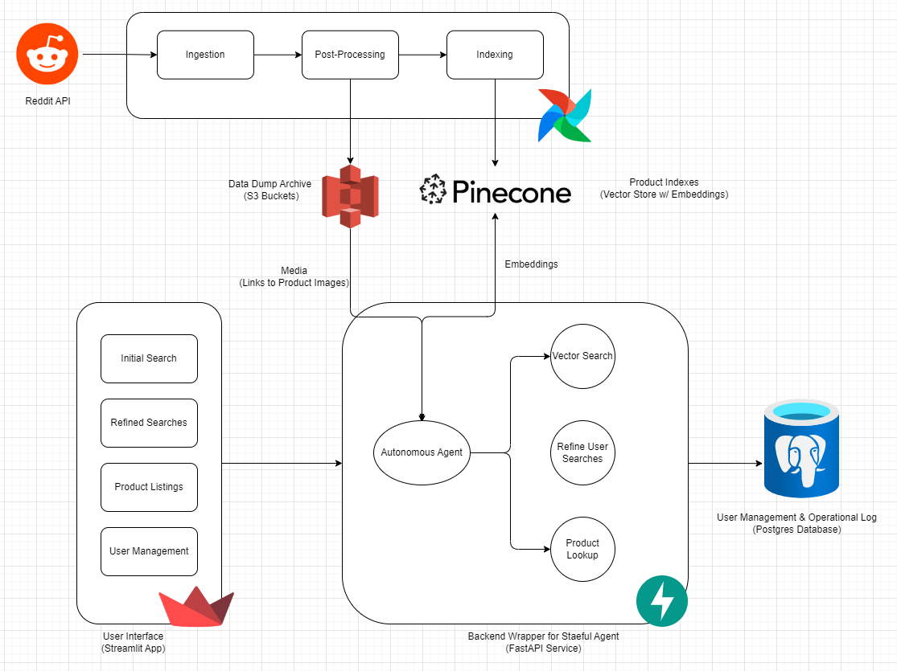

# Rekomme - AI-Powered Shopping Assistant

## Links
- [Codelab Documentation](https://codelabs-preview.appspot.com/?file_id=1_3vmWoFDZWP4ZyiS7CvwQDF8ZwlRLUFJcXMgObKIjLE#0)
- [Deployed Streamlit Application](http://54.166.164.60:8501)
- [Deployed FastAPI Backend](http://54.166.164.60:8000/docs)
- [Demo Video](video/video.mov)

## Objective
Shopping Agent aims to revolutionize the online shopping experience by leveraging the collective wisdom of Reddit communities to provide authentic, crowd-sourced product recommendations.

## Features
- Authentic product recommendations from Reddit communities
- Semantic matching of user queries with community discussions
- Integration with major e-commerce platforms (Amazon, Walmart, eBay)
- Real-time product information and pricing
- User-friendly web interface for product search

## Technologies and Tools
- **Backend**: 
  - Python
  - FastAPI
  - Apache Airflow
- **Frontend**: 
  - Streamlit
- **Database**: 
  - PostgreSQL
  - Pinecone (Vector Embeddings)
- **Deployment**: 
  - Docker
  - AWS

## Architecture Diagram:
  
  
  
## Project Methodology
### Data Extraction
- Scrape relevant subreddits using Reddit API
- Extract posts, comments, and user experiences
- Semantic matching of user queries with community discussions

### Recommendation Engine
- Vector embedding of Reddit posts
- Natural language search across community discussions
- LLM-powered filtering for positive experiences
- Real-time product listing fetching from e-commerce APIs

## Setup and Installation

1. Clone the repository:
   ```bash
   git clone https://github.com/BigDataIA-Fall2024-TeamA2/FinalProjectProposal
   ```

2. Install dependencies:
   ```bash
   # Add specific installation instructions
   poetry install --dev
   ```

3. Set up environment variables:
   ```bash
   cp .env.example .env
   # Configure your API keys and credentials
   ```

4. Run the application:
   ```bash
   # Add specific run instructions
   docker-compose up
   ```

5. Access the Airflow UI at `http://localhost:8080` to monitor and manage the pipeline.

6. Run the frontend application:
   ```
   streamlit run frontend/app.py
   ```


## Project Structure
```
.
├── Architecture
│   └── Arch_v1.drawio.png
├── README.md
├── airflow.Dockerfile
├── airflow.requirements.txt
├── app.py
├── backend
│   ├── __init__.py
│   ├── __pycache__
│   │   ├── __init__.cpython-312.pyc
│   │   ├── config.cpython-312.pyc
│   │   └── utils.cpython-312.pyc
│   ├── agent
│   │   ├── __init__.py
│   │   ├── __pycache__
│   │   │   ├── __init__.cpython-312.pyc
│   │   │   ├── edges.cpython-312.pyc
│   │   │   ├── generate_chain.cpython-312.pyc
│   │   │   ├── grader.cpython-312.pyc
│   │   │   ├── graph.cpython-312.pyc
│   │   │   ├── nodes.cpython-312.pyc
│   │   │   └── vector_store.cpython-312.pyc
│   │   ├── edges.py
│   │   ├── generate_chain.py
│   │   ├── grader.py
│   │   ├── graph.py
│   │   ├── nodes.py
│   │   └── vector_store.py
│   ├── config.py
│   ├── database
│   │   ├── __init__.py
│   │   ├── __pycache__
│   │   │   ├── __init__.cpython-312.pyc
│   │   │   ├── db.cpython-312.pyc
│   │   │   └── users.cpython-312.pyc
│   │   ├── chat_sessions.py
│   │   ├── db.py
│   │   ├── messages.py
│   │   └── users.py
│   ├── logging.conf
│   ├── main.py
│   ├── schemas
│   │   ├── __init__.py
│   │   ├── __pycache__
│   │   │   ├── __init__.cpython-312.pyc
│   │   │   ├── auth.cpython-312.pyc
│   │   │   ├── chain.cpython-312.pyc
│   │   │   └── search.cpython-312.pyc
│   │   ├── auth.py
│   │   ├── chain.py
│   │   ├── choices.py
│   │   ├── search.py
│   │   └── users.py
│   ├── server.py
│   ├── services
│   │   ├── __init__.py
│   │   ├── __pycache__
│   │   │   ├── __init__.cpython-312.pyc
│   │   │   ├── auth.cpython-312.pyc
│   │   │   ├── choices.cpython-312.pyc
│   │   │   └── search.cpython-312.pyc
│   │   ├── auth.py
│   │   ├── auth_bearer.py
│   │   ├── choices.py
│   │   ├── debug_response.json
│   │   ├── search.py
│   │   ├── test.py
│   │   └── users.py
│   ├── utils.py
│   └── views
│       ├── __init__.py
│       ├── auth.py
│       ├── choices.py
│       ├── search.py
│       └── users.py
├── config
├── dags
│   ├── __pycache__
│   │   ├── reddit_data_processor.cpython-312.pyc
│   │   ├── reddit_data_processor.cpython-313.pyc
│   │   ├── reddit_pipeline.cpython-312.pyc
│   │   ├── reddit_scrapper.cpython-312.pyc
│   │   ├── reddit_scrapper.cpython-313.pyc
│   │   └── tutorial.cpython-312.pyc
│   ├── reddit_data_processor.py
│   ├── reddit_pipeline.py
│   ├── reddit_posts.py
│   ├── reddit_scrapper.py
│   ├── scrapper.py
│   └── tutorial.py
├── docker-compose.yaml
├── frontend
│   ├── config.py
│   ├── pages
│   │   ├── chat.py
│   │   ├── login.py
│   │   ├── productlist.py
│   │   └── register.py
│   └── utils
│       ├── api_utils.py
│       ├── auth.py
│       └── chat.py
├── plugins
├── poetry.lock
├── pyproject.toml
└── tests
    ├── __init__.py
    ├── __pycache__
    │   ├── __init__.cpython-312.pyc
    │   ├── test_auth.cpython-312-pytest-8.3.4.pyc
    │   ├── test_search.cpython-312-pytest-8.3.4.pyc
    │   └── test_users.cpython-312-pytest-8.3.4.pyc
    ├── backend
    │   ├── __init__.py
    │   ├── __pycache__
    │   │   ├── __init__.cpython-312.pyc
    │   │   ├── test_auth.cpython-312-pytest-8.3.4.pyc
    │   │   └── test_users.cpython-312-pytest-8.3.4.pyc
    │   └── test_users.py
    ├── frontend
    │   └── __init__.py
    ├── test_auth.py
    └── test_search.py
```

## Team
- **Pranali Chipkar**: ETL Pipeline, Data Storage, and Processing
- **Gopi Krishna Gorle**: APIs, Recommendation Engine, E-commerce Integrations
- **Mubin Modi**: User Interface and User Experience Design

## Expected Outcomes
- 85%+ recommendation accuracy
- 40% reduction in product search time
- Authentic, trustworthy product recommendations
- Streamlined online shopping experience

## End User Validation
- 90% relevance in search results
- Real-time price matching with e-commerce platforms
- Accurate product category filtering

## Risks and Mitigation
- Implemented error handling for API limitations
- Comprehensive data validation processes
- Scalable cloud-based architecture
- Modular e-commerce platform integration

## Contribution
- Pranali Chipkar: 33%
- Gopi Krishna Gorle: 33%
- Mubin Modi: 33%

